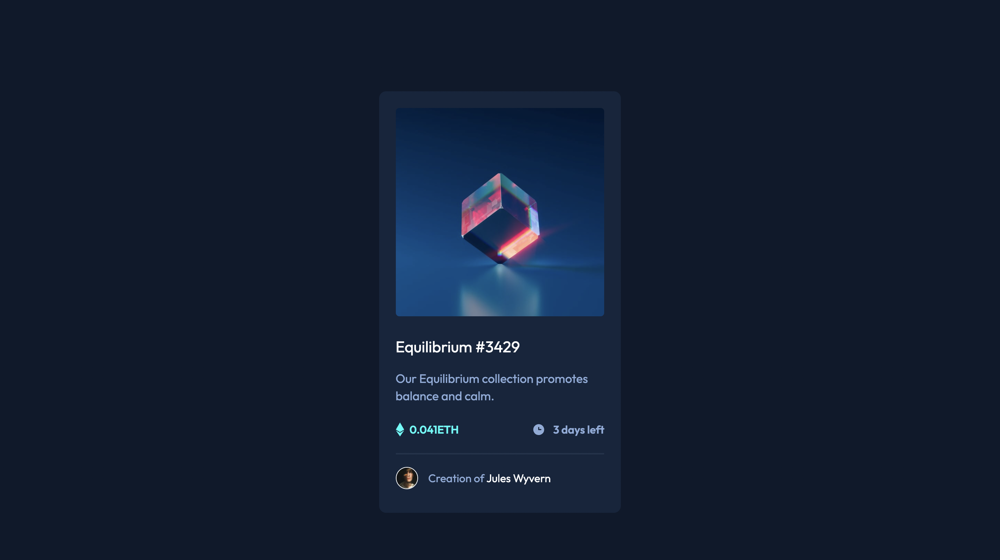

<h1 align="center">NFT preview card component</h1>

## About The Project

The challenge of this project is to create this preview card component and make it as close to the design as possible.
You can use any tool you like to help you complete the challenge. So if you have something you'd like to practice, feel free to give it a try.
This HTML and CSS challenge is ideal for beginners or anyone who wants a small project to study.

Your users should be able to:

- View optimal layout depending on device screen size
- See hover states for interactive elements

## Built with

- Semantic HTML5 markup
- CSS custom properties
- Flexbox
- Desktop-first workflow
